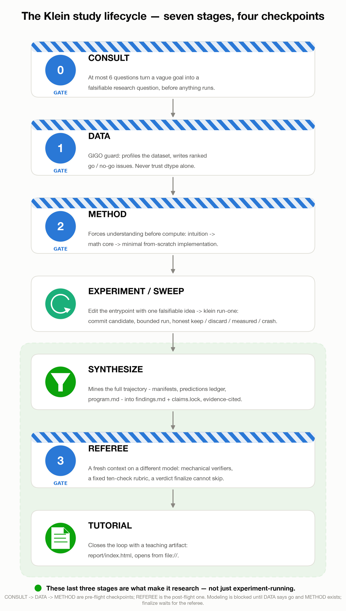
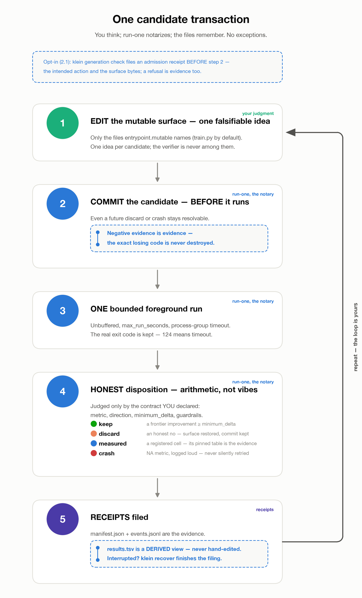
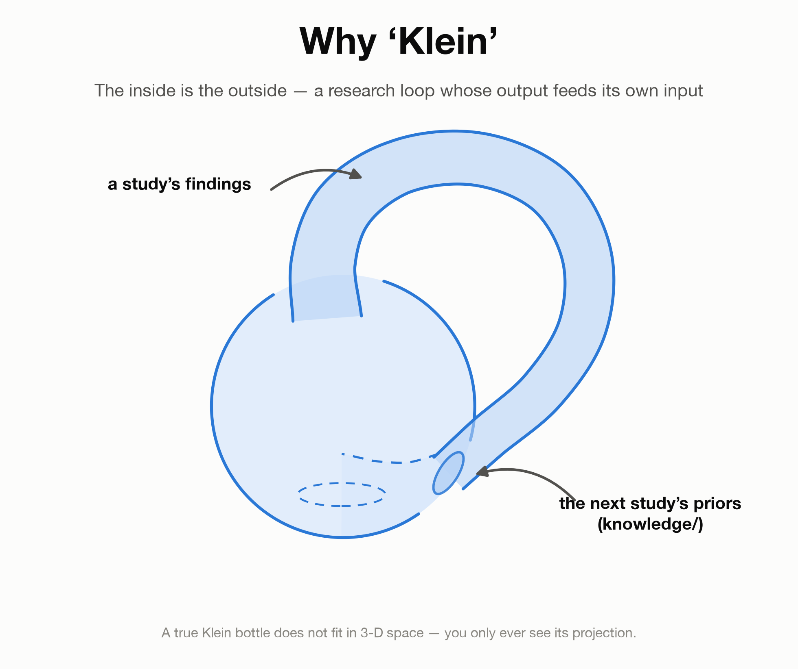

# Klein Auto Research

[](https://github.com/Xiang-Shan/klein-auto-research/actions/workflows/ci.yml)
[](LICENSE)
[](pyproject.toml)

**Process-verifiable research for AI for Science.** Klein is the lab-notebook
discipline an AI agent runs *inside*: a typed research question, predictions
registered before their evidence, every run notarized in git, claims whose strength
is earned, an independent referee before anything is called a finding — and a
stranger left able to audit the whole process with no model in the loop. It works on
your data, on public data, on a simulator, or on nothing but a verifier; it closes
every study with mined insights, a claims lock, a referee's verdict, and a
self-contained tutorial that teaches the method back to you.

It is not hard to let an agent do research overnight. What is hard is signing the
conclusion the next morning. Klein exists for the signature.

Klein runs research **studies** through a fixed seven-stage lifecycle with four gates:

```
new ─▶ CONSULT ─▶ DATA ─▶ METHOD ═══▶ EXPERIMENT/SWEEP ─▶ SYNTHESIZE ─▶ REFEREE ─▶ TUTORIAL
        Gate 0   Gate 1   Gate 2      └ the honest loop ┘    findings.md    Gate 3     report/
```

<p align="center"></p>

## Why Klein — the three failures, made measurable

In April 2026 a study of 25,000+ runs of AI-scientist systems across eight domains
(Ríos-García, Jablonka et al., arXiv:2604.18805) found that the agents produce results
without reasoning scientifically: evidence was ignored in 68 % of traces,
refutation-driven belief revision happened in 26 %, convergent multi-test evidence was
rare — and *outcome-based evaluation cannot detect any of it*. Scaffolding explained
1.5 % of outcome variance; no scaffold makes a model reason better. What a scaffold
CAN do is make those failures detectable and force the missing behaviours. That is
what Klein does, mechanically, with no model checking itself:

| Failure the 2026 study measured | What Klein makes mechanical |
|---|---|
| **Evidence ignored** (68 % of traces) | Every candidate is committed *before* it runs; discards, crashes and measured cells are retained with resolvable commits; `klein verify --evidence-use` reports the share of non-keep evidence the write-up actually cites and lists what it ignored. |
| **No belief revision on refutation** (26 % revise) | Predictions carry an arithmetic rule and are adjudicated by the notary inside the run transaction (`supported / refuted / inconclusive`); a refuted prediction with no dated `Decision:` line in the lab notebook fails verification; `finalize` refuses open predictions. |
| **Convergent evidence rare** | One sealed look per track, `klein replicate` re-executing a run in a detached worktree, a declared verifier re-run on the pinned artifact; a claim is `confirmed` only with the evidence kinds its track requires, and single-source confirmations are flagged on the receipt. |
| **Outcome evaluation cannot see it** | The receipt (`verify_receipt.json`) carries the three numbers; the claims lock ties every number in the write-up to a pinned artifact; an independent **referee** on a different model applies a fixed ten-check rubric before `finalize` — the answer to "the reviewer is the same model checking itself". |

The rest of the discipline is the part its studies paid for: a measured noise
floor with a named estimand before any comparison; a detection-limit law that
refuses a tournament decided before it runs; contract-driven data splits with a
printed fingerprint the notary checks (an evaluator once hardcoded a retired seed for
a whole study — the lock's numeral scan caught it); a sealed dry-run that spends
nothing (a study once lost its only confirmation to a crash before any data was
read); errata that re-scope and never delete. The incident reports are in
[`.claude/skills/klein/references/war-stories.md`](.claude/skills/klein/references/war-stories.md);
the promoted lessons, each cited to the claim that earned it, in
[`knowledge/research-discipline.md`](knowledge/research-discipline.md).

## One kernel, any inquiry

Klein types a study on three orthogonal axes and the same trust kernel serves all of
them:

| Axis | Values | What it changes |
|---|---|---|
| **kind** — the question's shape | `predict` · `estimate` · `test` · `simulate` · `replicate` · `discover` · `optimize` | track mode (frontier climbs; registered measures), what "sealed" means, what `confirmed` requires, the strength a claim can reach |
| **modality** — the evidence source | `tabular` · `timeseries` · `image` · `sequence` · `graph` · `text` · `simulation` · `none` | the data-gate card (leakage audit, time policy, group policy, DGP card, verifier card) |
| **profile** — the audience | `generic` · `ml-research` · `math` · `insurance` · your own `profile_doc` | headings, doctrine anchors, figure sets, budgets, banned words — never what the engine checks |

A mathematician searching for a construction declares an exact verifier and a
literature incumbent, and a keep means "beat the best known value". A deep-learning
researcher budgets in steps, measures a five-seed fit-noise floor, and lets a verifier
script — not the training script — score the checkpoint. A physicist replicating a
1929 table registers each target value with its tolerance and reports them one by one.
An actuary keeps the calibration-first doctrine that Klein was first proven on. The
engine does not know the difference; the protocols do. Read
[`.claude/skills/klein/references/inquiry-model.md`](.claude/skills/klein/references/inquiry-model.md).

## Quickstart

Needs Python ≥ 3.11, [uv](https://docs.astral.sh/uv/), and git. No credentials, no
downloads, no data hub: the quickstart is a five-minute study on synthetic data whose
truth you know — the only way to *show* the detection-limit law against a known
ideal — and every dataset an exhibit needs is bundled or generated.

```bash
git clone https://github.com/Xiang-Shan/klein-auto-research
cd klein-auto-research
uv sync --locked --extra encoders
uv run --no-sync klein doctor                       # what this machine can run; fetches nothing
uv run --no-sync pytest kleinlib/tests .claude/skills/klein/scripts/tests scripts/tests -q
uv run --no-sync python scripts/verify_shipped_studies.py   # every shipped ledger still verifies
uv run --no-sync klein verify --study studies/00-known-truth-quickstart --numbers   # the receipt
```

Then open `studies/00-known-truth-quickstart/report/index.html` — offline, one file —
and read its `claims.lock`: every number on that page has a home there.

Heads-up on extras: `uv sync` installs exactly what you name — and *removes* extras
you omit. Compose what a study needs: `--extra gbdt` (LightGBM/XGBoost/CatBoost),
`--extra deep` (PyTorch — needed only to re-run the character-language-model
exhibit), e.g. `uv sync --locked --extra encoders --extra gbdt --extra deep`.

## The `klein` command line

New studies default to `schema_version: 3` and are driven through the packaged
`klein` command. Run `--help` on any command for its complete arguments.

```bash
klein new 14-my-question --kind predict --modality tabular --profile generic \
    --metric val_auc --goal-direction higher --data "csv:data/my.csv" --track primary
git switch -c experiments/14-my-question        # the loop refuses to run on main
# author data_card.md / method_card.md at their gates (templates in assets/), then:
klein gate record consult --study studies/14-my-question --acknowledged-by <name>
klein gate record data    --study studies/14-my-question --acknowledged-by <name>
klein gate record method  --study studies/14-my-question --acknowledged-by <name>
klein noise-floor --study studies/14-my-question --recipe seed-sweep --estimand fit-noise
klein preflight   --study studies/14-my-question
klein run-one     --study studies/14-my-question --track primary --description "anchor" --tests P1
klein run-one     --study studies/14-my-question --track primary --final-test --dry-run
klein run-one     --study studies/14-my-question --track primary --final-test --description "sealed"
klein replicate   --study studies/14-my-question E0003
klein claims init --study studies/14-my-question && klein claims verify --study studies/14-my-question --numbers
klein gate record referee --study studies/14-my-question --acknowledged-by <name>   # after the referee's report
klein finalize    --study studies/14-my-question
klein verify      --study studies/14-my-question       # writes verify_receipt.json
```

Gate records, `finalize`, `recover`, `claims`, `predict adjudicate` and `verify`
commit their own state writes — the loop never dead-ends on receipts the CLI itself
generated. `klein gate override` records an explicit reason instead of silently
bypassing a gate; `klein headroom ack` and `klein stop ack` put a closed door on the
record; `klein predict adjudicate` records sidecar evidence with its hash; `klein
sweep register` makes a measurement sweep citable; `klein doctor` says what resolves
on this machine.

<p align="center"></p>

### Detection limit: audit headroom before spending challengers

A measured floor can honestly outgrow the incumbent's entire distance to perfection.
Study 07 registered `minimum_delta: 0.033` against an anchor Brier of 0.026744 — the
keep bar sat below zero, so no challenger could ever keep, and nothing said so.
Declare the metric's best achievable value and Klein does the subtraction:

```yaml
    metric:
      name: "val_brier"
      goal: "lower"
      minimum_delta: 0.033
      bound: {ideal: 0.0, on_infeasible: ack}
      noise_floor: {estimand: paired-comparison, ...}   # from `klein noise-floor`
```

`h = (incumbent − ideal) / minimum_delta` is disclosed at preflight, verify and
run-one; `h < 1` refuses further development runs until `klein headroom ack` records
the closed door. `h ≥ 1` means a keep is *not arithmetically excluded* — never that
one is plausible: study 08 stood at h = 1.015 and twenty-one challengers produced
zero keeps; study 09 closed its door at h = 0.33 before any challenger ran.

## Drive it with your agent — or none

Klein is agent-agnostic and calls no model API. The operating manual is
[`AGENTS.md`](AGENTS.md); the stage protocols it points to are plain markdown that any
tool (or human) can follow.

| You use… | How to drive Klein |
|---|---|
| **Codex, Copilot coding agent, Cursor, Jules, …** (tools that auto-read `AGENTS.md`) | *"run a Klein study on `<your data>` — follow the stage map in AGENTS.md"* |
| **Claude Code** | The `/klein` skill routes the same stages; eight worker agents ship pre-wired, the referee on a different model than the experimenter |
| **Claude Science** | Run Klein as the discipline inside a session: a custom agent follows `AGENTS.md`; the REFEREE stage goes to a different model or session |
| **Gemini CLI / Qwen Code** | Add `AGENTS.md` to the context files, or open with *"read AGENTS.md first"* |
| **GLM & other Anthropic-compatible CLIs** | They load `CLAUDE.md`, which imports `AGENTS.md` |
| **No agent** | `AGENTS.md` doubles as a human runbook; every helper script is a plain CLI |

Where Klein sits among its neighbours (positioning, not a benchmark):

| | Claude Science | Kosmos (arXiv:2511.02824) | Curie (arXiv:2502.16069) | autoresearch | **Klein 2.0** |
|---|---|---|---|---|---|
| Runs where | hosted workbench; laptop / HPC / cloud compute | hosted | local | local | local, any machine, from git |
| Model | Claude | its own | any | any | any — no model API inside Klein |
| Unit of work | a session with a plan and connectors | a structured world model | an experiment with rigor modules | one mutable script, a fixed budget | a typed inquiry under a notary |
| Verification | reviewer agent (same model) | statements cited to code or literature | intra- and inter-agent rigor | keep / discard | hash and ledger arithmetic with no model, then an independent referee |
| Pre-registration | plan first | — | — | — | contract-hashed predictions with arithmetic rules |
| Audit by a stranger | code, environment, message history | citation trails | — | git history | a git history whose every claim, number and decision resolves |

Klein does not compete with a workbench on connectors or scale; it is the discipline
a workbench's agent — or any other — can run inside, and what a stranger can check
afterwards. The full argument: [`docs/design/klein-2-design.md`](docs/design/klein-2-design.md).

## The shipped studies

Every study below ran the whole lifecycle in this repository's history: every
candidate commit resolves, every ledger verifies (`scripts/verify_shipped_studies.py`
runs in CI on every push), and every number in a findings file traces to a pinned
artifact.

**Klein 2.0 exhibits (schema 3) — one per axis of generality:**

| Study | kind · modality · profile | Question | Headline (from its `claims.lock`) |
|---|---|---|---|
| [`00-known-truth-quickstart`](studies/00-known-truth-quickstart/) | predict · tabular (synthetic) · generic | With the Bayes-optimal score known, does the loop reach it, and does the headroom law stop it honestly? | Three keeps closed the distance to the known ceiling from 10.4555 floors (val_auc 0.806201) to 1.7077 (0.871390); the one sealed look landed 1.68 floors from the sealed partition's own ceiling (confirmed); at h = 1.708 the over-capacity candidate lost 1.7903 floors; both replicate attempts failed for non-scientific reasons and stayed on the record |
| `10-hubble-1929-replication` | replicate + estimate · tabular · generic | Do Hubble's 1929 values reproduce from his own 24 objects, and what does the 1929 table actually support? | <!-- filled from claims.lock at release --> |
| `11-exact-verifier-construction` | optimize · none · math | Can a budgeted search match the best-known value under an exact verifier — and what may it claim when it cannot? | <!-- filled from claims.lock at release --> |
| `12-insurance-claims-frequency` | predict · tabular · insurance | Are GLM and GBDT anchors reproducible on 58k real auto-insurance claims, and how much headroom is there? | <!-- filled from claims.lock at release --> |
| `13-charlm-fixed-budget` | predict · text · ml-research | At a fixed step budget, which training-recipe changes clear a five-seed fit-noise floor, scored by a verifier the training script cannot touch? | <!-- filled from claims.lock at release --> |

**Schema-2 exhibits (frozen; verify under schema-2 rules forever):**

| Study | Question | Headline findings |
|---|---|---|
| [`03-noisy-rosenbrock-dfo`](studies/03-noisy-rosenbrock-dfo/) | At 200 noisy evaluations, do restarts beat Nelder-Mead — and does SPSA beat both? | Restarts win 2.96× the measured floor and the sealed fresh-seed run replicates (confirmed); random search ties them — found by the DATA gate before any run; "textbook" SPSA diverges because the method card's own tuning rule went unapplied |
| [`05-fremtpl2-gap-forensics`](studies/05-fremtpl2-gap-forensics/) | On 678k-row freMTPL2 frequency, WHERE does the GBDT's edge live, and does the gap survive two sealed tests? | Sealed gap 0.009564 = 9.3× its sealed paired SE (confirmed); ≈83 % of the gap is non-additive; below ~20–40k training rows the GLM wins outright |
| [`06-hurricane-gqls-returnlevels`](studies/06-hurricane-gqls-returnlevels/) | Does a from-scratch gQLS reproduce Adjieteh (2024) on the 30 most-damaging US hurricanes, and does its robustness reach the 1-in-100 loss? | All 120 published parameters reproduced SEALED at 0.002 once the loop found the thesis's own quantile convention; trimmed gQLS-lognormal holds the 1-in-100 loss to 0.0 % under 10× contamination while untrimmed MLE moves +99.4 % |
| [`07-iris-90years`](studies/07-iris-90years/) | Do ninety years of classifiers beat Fisher's 1936 discriminant on Fisher's irises? | The floor (0.033 Brier) outgrew the anchor's distance to perfection (0.026744): the keep bar sat below zero and was found by hand — the study that produced the headroom law |
| [`08-iris-rematch`](studies/08-iris-rematch/) | With the headroom registered first, does anyone walk through a door ajar at h = 1.015? | Twenty-one parade transactions, zero keeps; the best challenger improved by 0.16× the floor; of 113 cells one cleared the selection guard, at eight training rows, and its own fragility exhibit did not confirm it |
| [`09-iris-first-lesson`](studies/09-iris-first-lesson/) | Before any contest: which candidates even have *permission* to contest, at what resolution? | Door closed at h = 0.33 before a challenger ran; 0 of 42 cells cleared the guard; the sealed run crashed and the pre-registered branch closed the study exploratory; erratum E1 (a hardcoded retired seed) was caught by the lock's numeral scan and re-scoped, never deleted |

Three earlier exhibits and the original v1 quickstart are preserved intact at tags
[`v1.0.0`](https://github.com/Xiang-Shan/klein-auto-research/tree/v1.0.0/studies) and
[`v1.3.0`](https://github.com/Xiang-Shan/klein-auto-research/tree/v1.3.0/studies),
where every recorded candidate commit resolves. Open any tutorial to see what
"closing the loop" means: `open studies/10-hubble-1929-replication/report/index.html`.

## Run it on your own question

1. Scaffold, typed: `klein new 14-my-question --kind … --modality … --profile … --data <source tag>`
   (`csv:`, `parquet:`, `synthetic:<script>`, `bundled:<name>`, `hub:<name>`,
   `sklearn:<loader>`, `openml:<id>`, `url:<https://…>` — network sources are pinned
   by sha256 and refused under `KLEIN_OFFLINE=1`).
2. CONSULT: at most six questions turn the goal into research questions and
   predictions with rules; anything you looked at first goes in the scouting ledger.
3. DATA: the modality-typed card ranks go/no-go issues; partitions come from the
   contract, never from a seed in a script.
4. METHOD: the card teaches the method to your profile's audience; a verifier, when
   declared, is hashed here and never edited again.
5. Branch to `experiments/14-my-question`, pass `klein preflight`, run one candidate
   (or one registered cell) at a time; rehearse the sealed run before spending it.
6. SYNTHESIZE writes findings and the lock; the REFEREE — another model — reads them
   before the story; `finalize` labels; the tutorial teaches it back.

Compute: one bounded foreground subprocess per run on whatever you have (`KLEIN_DEVICE`
overrides `mps → cuda → cpu`); a cluster job is a blocking submit-and-wait
entrypoint; long runs are budgeted in steps or tokens, not seconds. Details:
[`compute-and-devices.md`](.claude/skills/klein/references/compute-and-devices.md).

## Limitations

Klein cannot make a model reason better; it makes reasoning failures detectable and
forces the missing behaviours. It runs one experiment at a time and does not
schedule, parallelize, or learn a policy across runs. It does not execute notebooks.
The referee is independent by mechanism, not by magic: a fresh session of the same
model is the lowest rung of the independence ladder, and the rung reached is on the
record. A measured floor bounds honesty, not power. A lock verifies that numbers have
homes, not that the homes were the right places to look. Evaluator shapes today:
binary classification, point/rate regression (incl. Poisson/Gamma/Tweedie deviance),
scalar, estimate, test and table cells; multiclass, survival and ranking are
documented extension points.

## Is Klein a skill or a harness? Both — a harness that carries a skill.

- **Harness (recommended):** this repo is a complete research lab — engine
  (`kleinlib`), lifecycle skill, agents, knowledge base, executed exhibits. Clone it
  and run studies inside; your ledgers' commit hashes resolve here.
- **Skill (portable doctrine):** copy `.claude/skills/klein/` into any repo — the
  protocols are self-contained markdown, and the engine is a one-line git dependency
  pinned by tag *and* commit (see `assets/pyproject-study-template.toml`). The
  "skill" packaging is Claude Code's; every file inside is plain markdown/Python that
  any agent reads, and `AGENTS.md` is the tool-neutral router for the same doctrine.

## Layout

| Path | What |
|---|---|
| `AGENTS.md` | the operating manual — for any coding agent, or a human driving by hand |
| `.claude/skills/klein/` | the lifecycle protocols, profiles, templates, and helper scripts — plain markdown/Python (packaged as the `/klein` skill for Claude Code) |
| `.claude/agents/` | eight optional worker-role definitions (pre-wired for Claude Code) |
| `kleinlib/` | engine: contract, events, state, transactions, decisions, checks, claims, metrology, sources, data/eval/figures/torch helpers, sweep runner |
| `knowledge/` | promoted lessons (`research-discipline.md`), domain knowledge by profile, method cards |
| `datasets/` | bundled datasets with their own licences and provenance |
| `studies/` | one directory per study — the unit of research |
| `docs/design/` | the Klein 2.0 design rationale; `docs/migration-schema2-to-3.md` |
| `scripts/` | `verify_shipped_studies.py`, the end-to-end proof, tests of the docs themselves |
| `CLAUDE.md` | Claude Code's entry point — imports AGENTS.md |

## Lineage & citing

Klein descends from [karpathy/autoresearch](https://github.com/karpathy/autoresearch)
(the `program.md` lab-notebook + edit-run-log loop) via
[elan-elan/agent-smith](https://github.com/elan-elan/agent-smith) (the loop as a
portable skill). Klein keeps the loop and adds the gates, the notary, the registered
predictions, the claims lock, the referee, and the mandatory synthesis and tutorial
stages. The name nods to the Klein bottle: a research loop whose output feeds its own
input.

<p align="center"></p>

Release history: [`CHANGELOG.md`](CHANGELOG.md). Versioning is SemVer: 2.0.0 froze
the schema-3 contract, the `klein` CLI surface and the ledger formats; schema-2
studies and locks stay readable forever. To cite Klein, see
[`CITATION.cff`](CITATION.cff). To contribute, see [`CONTRIBUTING.md`](CONTRIBUTING.md);
report vulnerabilities via [`SECURITY.md`](SECURITY.md). The software is MIT licensed
([LICENSE](LICENSE)); third-party data and lineage notices are collected in
[`THIRD_PARTY_NOTICES.md`](THIRD_PARTY_NOTICES.md); every bundled dataset carries its
own licence and attribution under `datasets/`.
