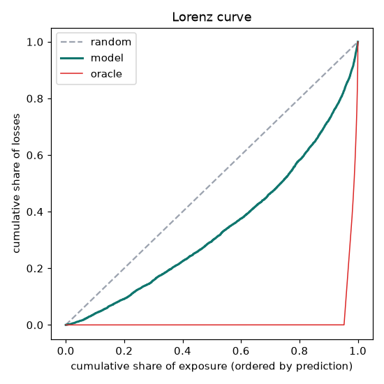
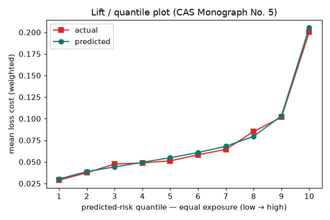
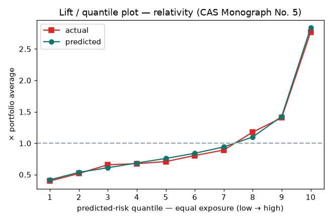
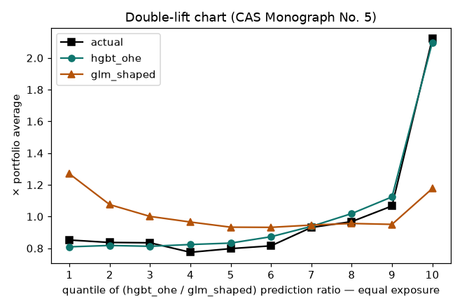
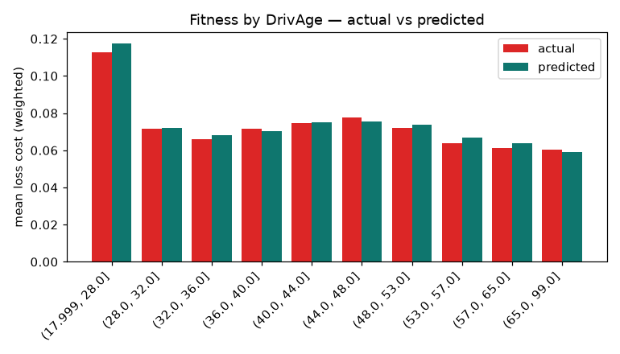
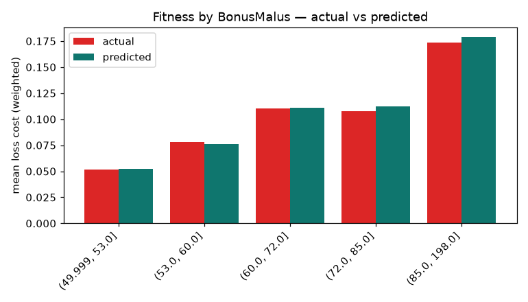
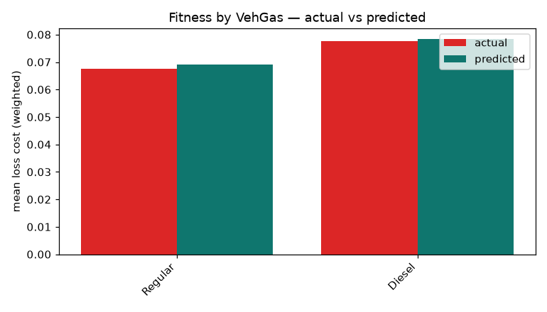

# Eval card — freMTPL2 claim frequency — study 04 incumbent (E0003)

- rows: **135,603**  ·  Tweedie power: **1.0** (dataset-dependent — see note)

## Headline metrics

| Metric | Value | Gate | Verdict |
| --- | --- | --- | --- |
| Tweedie deviance (lower=better) | **0.444689** | — | — |
| Normalized Gini (higher=better) | **0.3284** | — | — |
| Calibration (Σpred/Σobs) | **1.0149** | [0.9, 1.1] | ✅ pass |
| Lift (top/bottom quantile) | **6.96×** | — | — |
| Monotone lift across bands | **yes** | yes | ✅ |

## Charts

- **Lorenz / Gini** — ranking power.
- **Lift / quantile plot** — predicted vs actual over equal-exposure quantiles (absolute & relativity).
- **Double-lift** — `hgbt_ohe` vs `glm_shaped` where they most disagree.

## Lift / quantile band table (equal-exposure, ordered by prediction)

| Band | Weight | Pred mean | Actual mean | Pred rel | Actual rel | Pred/Actual |
| --- | --- | --- | --- | --- | --- | --- |
| 1 | 7,150 | 0.03 | 0.03 | 0.42 | 0.40 | 1.047 |
| 2 | 7,150 | 0.04 | 0.04 | 0.54 | 0.52 | 1.035 |
| 3 | 7,151 | 0.04 | 0.05 | 0.61 | 0.66 | 0.928 |
| 4 | 7,149 | 0.05 | 0.05 | 0.68 | 0.67 | 1.015 |
| 5 | 7,151 | 0.05 | 0.05 | 0.76 | 0.71 | 1.071 |
| 6 | 7,149 | 0.06 | 0.06 | 0.84 | 0.80 | 1.044 |
| 7 | 7,151 | 0.07 | 0.06 | 0.94 | 0.89 | 1.056 |
| 8 | 7,151 | 0.08 | 0.09 | 1.10 | 1.18 | 0.934 |
| 9 | 7,150 | 0.10 | 0.10 | 1.43 | 1.40 | 1.015 |
| 10 | 7,151 | 0.21 | 0.20 | 2.84 | 2.77 | 1.025 |

## Double-lift — hgbt_ohe vs glm_shaped

Records bucketed by the A/B prediction ratio (equal exposure). Where the lines
diverge, the model whose line is closer to *actual* wins that segment.

| Band | Weight | Actual | hgbt_ohe | glm_shaped |
| --- | --- | --- | --- | --- |
| 1 | 7,150 | 0.06 | 0.06 | 0.09 |
| 2 | 7,150 | 0.06 | 0.06 | 0.08 |
| 3 | 7,151 | 0.06 | 0.06 | 0.07 |
| 4 | 7,150 | 0.06 | 0.06 | 0.07 |
| 5 | 7,151 | 0.06 | 0.06 | 0.07 |
| 6 | 7,150 | 0.06 | 0.06 | 0.07 |
| 7 | 7,151 | 0.07 | 0.07 | 0.07 |
| 8 | 7,150 | 0.07 | 0.07 | 0.07 |
| 9 | 7,150 | 0.08 | 0.08 | 0.07 |
| 10 | 7,151 | 0.15 | 0.15 | 0.09 |

## Fitness by rating dimension (actual vs predicted)

### DrivAge

| DrivAge | Weight | Predicted | Actual | Bias (P/A) |
| --- | --- | --- | --- | --- |
| (17.999, 28.0] | 6,270 | 0.12 | 0.11 | 1.044 |
| (28.0, 32.0] | 5,854 | 0.07 | 0.07 | 1.010 |
| (32.0, 36.0] | 6,701 | 0.07 | 0.07 | 1.035 |
| (36.0, 40.0] | 6,959 | 0.07 | 0.07 | 0.982 |
| (40.0, 44.0] | 6,983 | 0.08 | 0.07 | 1.007 |
| (44.0, 48.0] | 6,998 | 0.08 | 0.08 | 0.976 |
| (48.0, 53.0] | 9,229 | 0.07 | 0.07 | 1.027 |
| (53.0, 57.0] | 6,238 | 0.07 | 0.06 | 1.049 |
| (57.0, 65.0] | 7,449 | 0.06 | 0.06 | 1.042 |
| (65.0, 99.0] | 8,822 | 0.06 | 0.06 | 0.978 |

### BonusMalus

| BonusMalus | Weight | Predicted | Actual | Bias (P/A) |
| --- | --- | --- | --- | --- |
| (49.999, 53.0] | 47,404 | 0.05 | 0.05 | 1.013 |
| (53.0, 60.0] | 7,089 | 0.08 | 0.08 | 0.979 |
| (60.0, 72.0] | 7,002 | 0.11 | 0.11 | 1.009 |
| (72.0, 85.0] | 5,053 | 0.11 | 0.11 | 1.040 |
| (85.0, 198.0] | 4,955 | 0.18 | 0.17 | 1.033 |

### VehGas

| VehGas | Weight | Predicted | Actual | Bias (P/A) |
| --- | --- | --- | --- | --- |
| Regular | 37,433 | 0.07 | 0.07 | 1.021 |
| Diesel | 34,070 | 0.08 | 0.08 | 1.009 |

## Notes

- **Calibration is a train/portfolio property** (balance back). On a single heavy-tailed
  holdout the ratio can sit below the band purely from where large claims landed.
- **Tweedie power is dataset-dependent.** freq → p=1, severity → p=2, pure premium / loss
  ratio → 1<p<2 (p≈1.9 fits freMTPL2). Choose it for your data; don't assume.
- **Lift/quantile, double-lift & equal-exposure bucketing** follow Goldburd, Khare, Tevet & Guller,
  *Generalized Linear Models for Insurance Rating*, CAS Monograph No. 5.
